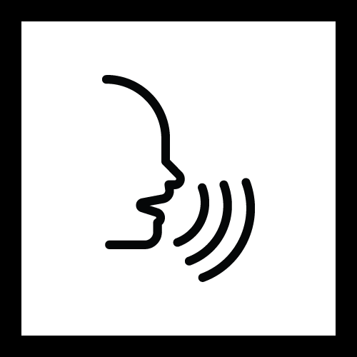

<h1 align="center">
   Spoken Digit Recognition
</h1>

<h4 align="center">
  🎙️ Spoken Digit Recognition with LSTM
</h4>

## Contents

* [Overview](#overview)
* [Dataset](#dataset)
* [Model](#model)
* [Results](#results)
* [Usage](#usage)
* [Dependencies](#dependencies)
* [References](#references)
* [Attribution](#attribution)
* [Contributing](#contributing)
* [License](#license)

## Overview

Spoken Digit Recognition is an **isolated word recognition** system that transcribes individual spoken numbers.

## Dataset

The [Free Spoken Digit Dataset (FSDD)](https://github.com/Jakobovski/free-spoken-digit-dataset) was used to train the model which had 1,500 recordings from 3 speakers with english accents.

The model was trained on 1,470 recordings, and tested on 30.

## Model and Training

The model consists of:

- LSTM Layer
- Fully Connected Layer
- Loss Function: Categorical Cross-Entropy
- Optimization Algorithm: Adam

Model is trained on 300 epochs.

## Usage

## Dependencies

* Numpy
* Librosa
* Tensorflow
* TFLearn

## References

* [Long Short-Term Memory Recurrent Neural Network Architectures for Large Scale Acoustic Modeling](https://static.googleusercontent.com/media/research.google.com/en//pubs/archive/43905.pdf)
* [Free Spoken Digit Dataset](https://github.com/Jakobovski/free-spoken-digit-dataset)
* [Hands-on Natural Language Programming w/ Python](https://www.amazon.com/Hands-Natural-Language-Processing-Python-ebook/dp/B07D6KYQYP) by 
* [Digit Recognition from Sound](https://github.com/adhishthite/sound-mnist)

## Attribution

* Icon by [Kiran Joseph](https://thenounproject.com/kiranjoseph/) from [thenounproject](https://thenounproject.com/)

## Contributing

Contributions are always welcome! For bug reports or requests please submit an issue.

## License

[MIT](https://github.com/moebg/spoken-digit-recognition/blob/master/LICENSE)

